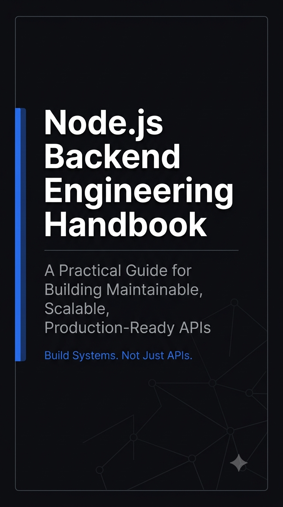
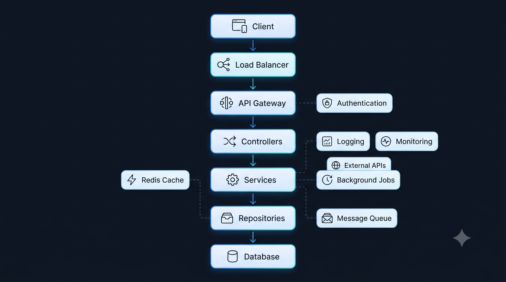

<div align="center">

# 🟢 Node.js Backend Engineering Handbook

### Build Systems. Not Just APIs.

*A practical, no-nonsense guide for building maintainable, scalable, production-ready APIs with Node.js.*



[](./LICENSE)
[](https://nodejs.org)
[](#-contributing)
[](#)

[Read Online](#-table-of-contents) · [Download PDF](#-download-the-pdf) · [Contributing](#-contributing)

</div>

---

## 📖 About This Handbook

This handbook is not another "how to write Express routes" tutorial. It's a distillation of the engineering judgment that separates a backend that *works* from a backend that *survives* — survives growth, survives incidents, survives the engineer who wrote it leaving the company.

It walks through how a request actually travels through a system, why layered architecture exists, how to design APIs people don't have to guess at, how Node.js really achieves its performance, why most production issues are database issues in disguise, how to think about performance versus scalability, what it actually takes to run something in production, and the habits that separate junior, mid-level, and senior engineers.

> [!NOTE]
> This repository is a reformatted, restructured, and diagram-enhanced edition of the original *Node.js Backend Engineering Handbook* PDF. The content, wording, and teaching style are preserved — only the presentation, navigation, and visuals have been upgraded for readability. The original PDF is included in [`/pdf`](./pdf/Backend-Engineering-Handbook.pdf).

---

## 🤔 Why This Handbook Exists

Most backend content online teaches syntax. Very little of it teaches **judgment** — when to put logic in a service versus a repository, when a transaction is actually needed, when to reach for caching versus scaling horizontally, and why "it works on my machine" is the beginning of a production incident, not the end of one.

This handbook exists to close that gap: a single, opinionated reference that captures the recurring principles experienced backend engineers rely on, regardless of which framework or library is fashionable this year.

---

## 👤 Who This Is For

- Backend engineers working with Node.js APIs who want to level up from "it works" to "it's production-ready"
- Mid-level engineers preparing for senior / staff-level responsibilities
- Engineers who want a mental model for where logic belongs in a layered architecture
- Teams who want a shared vocabulary and a shared checklist for code review and production readiness
- Anyone studying for backend system design interviews

---

## 🗂️ Topics Covered

| # | Topic | What You'll Learn |
|---|---|---|
| 1 | [Backend Architecture](./handbook/01-backend-architecture.md) | Layered architecture, controllers, services, repositories, transactions |
| 2 | [API Engineering](./handbook/02-api-engineering.md) | REST design, status codes, validation, auth, JWT, versioning, error handling |
| 3 | [Node.js Engineering](./handbook/03-nodejs-engineering.md) | The event loop, Promises, async/await, common concurrency mistakes |
| 4 | [Database Engineering](./handbook/04-database-engineering.md) | Relationships, query optimization, indexes, the N+1 problem, transactions |
| 5 | [Performance & Scalability](./handbook/05-performance-and-scalability.md) | Caching, rate limiting, load balancers, horizontal scaling |
| 6 | [Production Engineering](./handbook/06-production-engineering.md) | Logging, monitoring, observability, security, CI/CD, Docker, Kubernetes, incident response |
| 7 | [Senior Engineering Principles](./handbook/07-senior-engineering-principles.md) | Readability, naming, code review, testing, tech debt, DRY/KISS/YAGNI, anti-patterns |

---

## 🖼️ Architecture at a Glance



*The full system taught across these seven chapters — from the client all the way down to the database, with caching, auth, observability, and messaging woven in. See it explained end-to-end starting in [Part 1 — Backend Architecture](./handbook/01-backend-architecture.md).*

---

## 📁 Repository Structure

```text
NodeJS-Backend-Engineering-Handbook/
│
├── README.md                          ← You are here
│
├── handbook/                          📘 The full handbook, split into chapters
│   ├── 01-backend-architecture.md
│   ├── 02-api-engineering.md
│   ├── 03-nodejs-engineering.md
│   ├── 04-database-engineering.md
│   ├── 05-performance-and-scalability.md
│   ├── 06-production-engineering.md
│   └── 07-senior-engineering-principles.md
│
├── assets/                            🎨 Visual assets & AI image prompts
│   ├── linkedin-banner.png
│   ├── backend-architecture.png
│   ├── request-lifecycle.png
│   ├── handbook-cover.png
│   └── IMAGE_PROMPTS.md               ← Detailed prompts to generate the above
│
├── pdf/                                📄 Original handbook as a portable PDF
│   └── Backend-Engineering-Handbook.pdf
│
├── LICENSE
└── .gitignore
```

---

## 📚 Table of Contents

<div align="center">

| Part | Chapter | Description |
|:---:|---|---|
| 🏛️ 01 | [**Backend Architecture**](./handbook/01-backend-architecture.md) | Request lifecycle, controller/service/repository layers, transactions |
| 🌐 02 | [**API Engineering**](./handbook/02-api-engineering.md) | REST design, status codes, validation, auth, JWT, versioning |
| ⚙️ 03 | [**Node.js Engineering**](./handbook/03-nodejs-engineering.md) | Event loop, Promises, async/await, concurrency pitfalls |
| 🗄️ 04 | [**Database Engineering**](./handbook/04-database-engineering.md) | Relationships, indexes, N+1 queries, transactions |
| 🚀 05 | [**Performance & Scalability**](./handbook/05-performance-and-scalability.md) | Caching, rate limiting, load balancing, horizontal scaling |
| 🏭 06 | [**Production Engineering**](./handbook/06-production-engineering.md) | Logging, monitoring, security, CI/CD, Docker, Kubernetes |
| 🎓 07 | [**Senior Engineering Principles**](./handbook/07-senior-engineering-principles.md) | Readability, naming, testing, tech debt, DRY/KISS/YAGNI |

</div>

---

## ⚡ Quick Navigation

- 🆕 **New here?** Start at [Part 1 — Backend Architecture](./handbook/01-backend-architecture.md)
- 🧭 **Looking for a specific topic?** Jump straight to a [chapter above](#-table-of-contents)
- ✅ **Want the condensed version?** Jump to the [Senior Backend Engineer's Checklist](./handbook/07-senior-engineering-principles.md#the-senior-backend-engineers-checklist)
- 🎨 **Building the visual assets?** See [`assets/IMAGE_PROMPTS.md`](./assets/IMAGE_PROMPTS.md)

---

## 📥 Download the PDF

Prefer reading offline, on a tablet, or printing a copy? The original handbook is available as a single PDF:

**➡️ [Backend-Engineering-Handbook.pdf](./pdf/Backend-Engineering-Handbook.pdf)**

---

## 🧭 How to Use This Handbook

1. **Read it top to bottom** if you're new to backend engineering — each part builds on the previous one, from architecture fundamentals through to senior-level judgment calls.
2. **Use it as a reference** if you're experienced — jump directly to the chapter or Golden Rule you need via the [Table of Contents](#-table-of-contents).
3. **Use the Golden Rules as a checklist.** Every chapter distills its lessons into a small set of memorable rules — skim these before a design review or a production deployment.
4. **Use it in code review.** The [Senior Engineering Principles](./handbook/07-senior-engineering-principles.md) chapter includes a full [production/PR checklist](./handbook/07-senior-engineering-principles.md#the-senior-backend-engineers-checklist) your team can adopt directly.
5. **Star ⭐ and bookmark it** so it's there the next time you're debating where a piece of logic belongs.

---

## 🤝 Contributing

Contributions are welcome — this handbook improves when practicing engineers sharpen it.

- 🐛 **Found an error or an outdated recommendation?** Open an issue.
- ✍️ **Want to improve wording or add an example?** Open a pull request — please preserve the existing tone (direct, principle-first, example-driven) and the "Golden Rule" callout pattern used throughout.
- 🎨 **Generating the image assets?** See [`assets/IMAGE_PROMPTS.md`](./assets/IMAGE_PROMPTS.md) for the exact prompts and drop the resulting PNGs into `assets/`.
- 📐 **Adding a diagram?** Prefer [Mermaid](https://mermaid.js.org/) diagrams (GitHub renders them natively) over static images so they stay easy to maintain.

Please keep pull requests focused — one topic or one chapter per PR makes review much easier.

---

## 📜 License

This project is licensed under the [MIT License](./LICENSE) — use it, fork it, adapt it for your team's internal wiki, just keep the attribution.

---

## ✍️ Author

Maintained as an open-source engineering reference. Originally authored as a personal Node.js backend engineering handbook and converted into this repository format for easier navigation, searchability, and community contribution.

If this handbook helped you make a better architectural decision, consider starring the repo ⭐ — it helps other engineers find it.

---

<div align="center">

**[⬆ Back to top](#-nodejs-backend-engineering-handbook)** · **[Start Reading →](./handbook/01-backend-architecture.md)**

</div>
