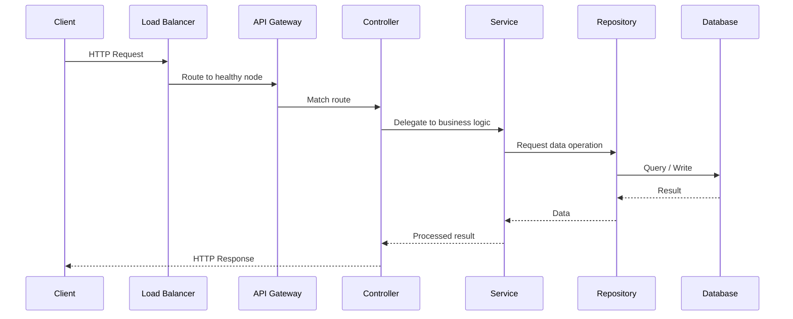
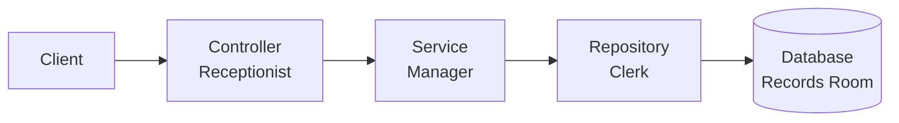
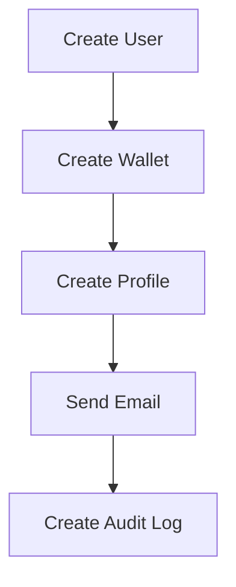
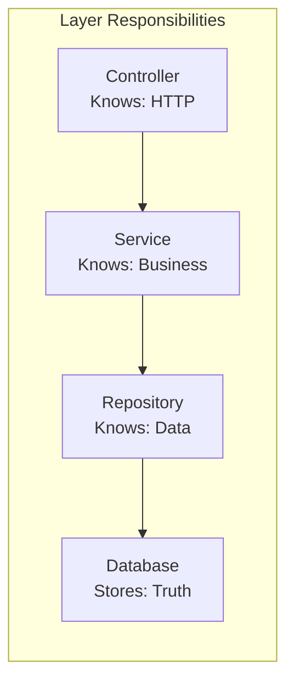
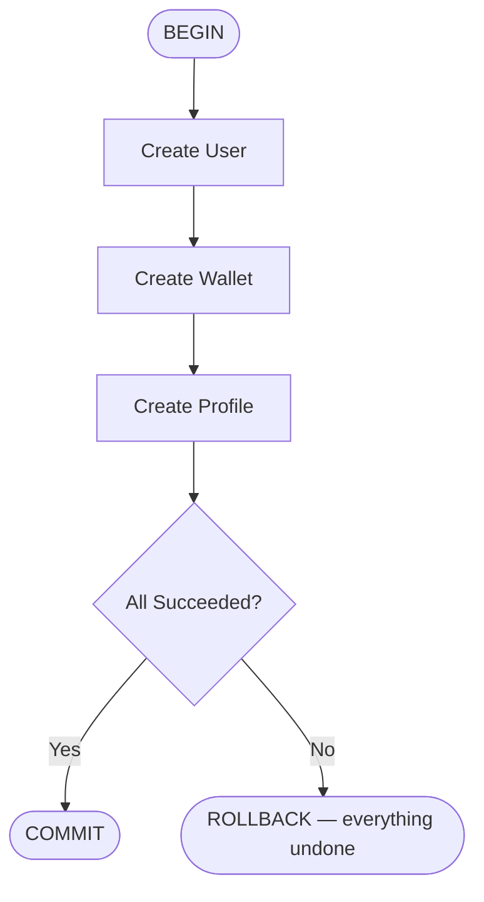

# 🏛️ Part 1 — Backend Architecture

> A Practical Guide for Building Maintainable, Scalable, Production-Ready APIs

[← Back to Table of Contents](../README.md#-table-of-contents) · [Next Chapter: API Engineering →](./02-api-engineering.md)

---

## Introduction

This handbook is intended for backend engineers working with Node.js APIs.

The goal is **not** simply to teach how to write code. The goal is to teach how to build systems that:

- Work correctly
- Scale gracefully
- Are easy to maintain
- Can be debugged in production
- Can be understood by future engineers

Throughout this handbook you'll notice recurring principles. **These principles matter more than any framework or library.**

> [!NOTE]
> **The First Principle**
>
> Many engineers think: *"My job is to write APIs."*
>
> A backend engineer's real responsibility is:
>
> **Build reliable systems that expose business capabilities through APIs.**
>
> The API is merely the interface. The real work is business logic, data consistency, reliability, security, performance, and scalability.

---

## Concepts

### How a Request Travels Through the System

Before discussing code, it helps to understand the journey of a request from the moment it leaves the client to the moment a response comes back.



Every layer has a specific responsibility. **Most backend problems occur when responsibilities are mixed.**

### Understanding Layers

Think of a company. A customer walks into a bank. The receptionist greets the customer. The manager makes business decisions. The clerk interacts with records and databases.

Your backend follows the same model.

| Real World | Application |
|---|---|
| Receptionist | Controller |
| Manager | Service |
| Clerk | Repository |
| Records Room | Database |



---

## Controller Layer

### What Is a Controller?

A controller is the entry point into your application. Its job is to translate HTTP requests into service calls.

Think of a controller as a receptionist. A receptionist does not decide whether a loan should be approved — a receptionist simply directs the request to the correct department. Controllers should do the same.

### Responsibilities

Controllers should:

- Read the request body
- Read request params
- Read query parameters
- Call services
- Return HTTP responses
- Pass errors to middleware

### What Does NOT Belong in Controllers?

Controllers should **never**:

- Query databases
- Start transactions
- Implement business rules
- Contain complex calculations
- Coordinate workflows

> [!WARNING]
> **Common Mistake**
>
> Many developers start here:
>
> ```
> Controller
>  ├── Validation
>  ├── Database Query
>  ├── Business Logic
>  ├── Email Sending
>  └── Response
> ```
>
> It works initially. Six months later it becomes impossible to maintain.

> [!TIP]
> **Golden Rule — Keep Controllers Thin**
>
> Controllers should coordinate requests, not implement business logic.
> A good controller often stays under 20–30 lines.

**Why this matters.** Thin controllers are easier to test, easier to understand, easier to maintain, and easier to scale.

---

## Service Layer

### What Is a Service?

Services contain business logic. This is the most important layer in most backend applications.

If controllers are receptionists, services are managers. Managers make decisions. Services do the same.

### Responsibilities

Services are responsible for:

- Business validation
- Workflow orchestration
- Transactions
- Business rules
- External service coordination

### Example

Requirement: *"When a user registers..."*

1. Create User
2. Create Wallet
3. Create Profile
4. Send Welcome Email

This is a business workflow, and the service owns it.

### Workflow Orchestration

A term you'll hear often is **workflow orchestration** — coordinating multiple operations to achieve a business outcome.



The service layer decides **what happens**, **in what order**, and **under what conditions**. Repositories should never make these decisions.

### Business Validation

There are two kinds of validation.

**Schema validation** checks things like email format, password length, and required fields. It's usually performed before reaching services.

**Business validation** checks things like: email already exists, product out of stock, user account disabled, wallet balance insufficient. Business validation requires external information — often a database lookup. Therefore:

> [!IMPORTANT]
> **If validation requires a database lookup, it belongs in the Service Layer.**

> [!TIP]
> **Golden Rule — Services Know Business**
>
> Whenever you're unsure where logic belongs, ask: *"Is this a business decision?"* If yes, it belongs in a service.

---

## Repository Layer

### What Is a Repository?

Repositories communicate with storage systems. They translate application requests into database operations.

Think of repositories as clerks retrieving and storing records. They should not make decisions — they simply execute requests.

### Responsibilities

Repositories should:

- Read data
- Insert data
- Update data
- Delete data

Nothing more.

### What Does NOT Belong Here?

Repositories should **not**:

- Send emails
- Perform authorization
- Implement workflows
- Implement business rules

> [!WARNING]
> **Common Mistake**
>
> ```text
> Bad Repository:
>   Create User
>   Create Wallet
>   Send Email
>   Audit Log
> ```
>
> This repository now knows too much. It becomes tightly coupled.

> [!TIP]
> **Golden Rule — Repositories Know Data**
>
> Keep repositories simple. The simpler repositories are, the easier databases become to change.

### Architecture Principle

If you remember only one thing from this chapter:

> **Keep Controllers Thin, Services Smart, and Repositories Dumb.**

This principle alone can keep a codebase maintainable long after it grows from 10 APIs to hundreds of APIs.



---

## Transactions

### What Is a Transaction?

A transaction ensures: either **everything** succeeds, or **nothing** succeeds.

Imagine a user registration process: Create User → Create Wallet → Create Profile.

- User creation succeeds.
- Wallet creation succeeds.
- Profile creation fails.

Without transactions, the database is now inconsistent:

| Record | State |
|---|---|
| User | Exists |
| Wallet | Exists |
| Profile | Missing |

With a transaction:



### Where Should Transactions Live?

A common junior mistake is placing transactions inside repositories. **Transactions belong in services.**

Reason: repositories manage individual operations, services manage business workflows, and transactions protect workflows. Therefore:

> [!IMPORTANT]
> **Transactions belong where the workflow lives — the Service Layer.**

---

## Golden Rules

| Rule | Summary |
|---|---|
| Keep Controllers Thin | Controllers coordinate, they don't implement logic |
| Services Know Business | If it's a business decision, it belongs in a service |
| Repositories Know Data | Keep repositories simple — reads and writes only |
| Transactions Belong in Services | Protect workflows, not individual operations |

---

## Examples

```text
Client
  ↓
Load Balancer
  ↓
API Gateway
  ↓
Route
  ↓
Controller
  ↓
Service
  ↓
Repository
  ↓
Database
```

```text
Response:

Database
  ↓
Repository
  ↓
Service
  ↓
Controller
  ↓
Client
```

---

## Summary

A well-layered backend keeps controllers thin, services smart, and repositories dumb. Requests flow predictably from the client through the load balancer, gateway, controller, service, and repository down to the database — and responses flow back the same way in reverse. Business workflows and transactions belong in the service layer; repositories should never make decisions.

---

[← Back to Table of Contents](../README.md#-table-of-contents) · **Next Chapter →** [02 — API Engineering](./02-api-engineering.md)
