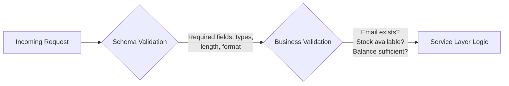
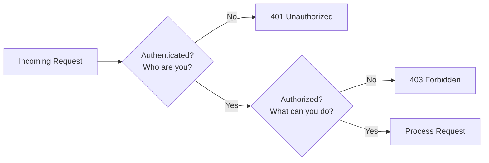
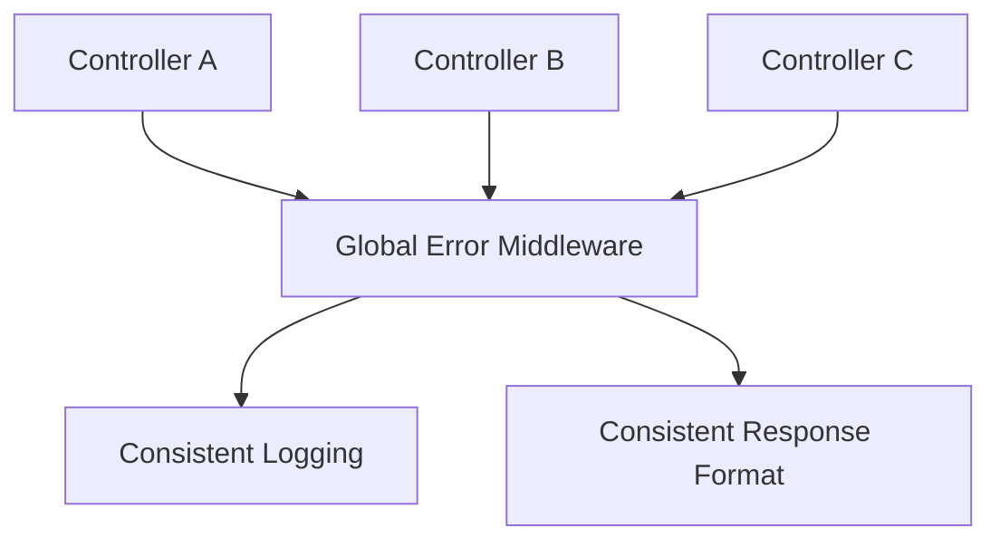

# 🌐 Part 2 — API Engineering

[← Previous: Backend Architecture](./01-backend-architecture.md) · [Back to Table of Contents](../README.md#-table-of-contents) · [Next Chapter: Node.js Engineering →](./03-nodejs-engineering.md)

---

## Introduction

An API (Application Programming Interface) is a contract between two systems.

Think of a restaurant. The customer does not enter the kitchen — the customer places an order through a menu. The menu is the API. The kitchen is your backend system. The customer does not need to know which database you're using, which framework you're using, or how data is stored. **The customer only cares about the contract.**

> [!TIP]
> **Golden Rule**
>
> Clients should never have to guess how your API works. APIs should be predictable, consistent, and well documented.

---

## Concepts

### REST API Design

Most Node.js APIs follow REST principles. Good APIs are boring — the more predictable they are, the easier they are to consume.

#### Naming Endpoints

| Method | Good ✅ | Bad ❌ |
|---|---|---|
| GET | `/users` | `/getUsers` |
| GET | `/users/:id` | `/getUserById` |
| POST | `/users` | `/createUser` |
| PUT | `/users/:id` | `/updateUser` |
| DELETE | `/users/:id` | `/deleteUser` |

**Why?** HTTP methods already describe the action. The endpoint should describe the *resource*.

> [!TIP]
> **Golden Rule**
>
> Use nouns in URLs. Use verbs in HTTP methods.

---

### HTTP Status Codes

Status codes communicate the result of a request. Many developers misuse them.

#### Common Status Codes

| Code | Meaning | Example |
|---|---|---|
| `200 OK` | Request succeeded | Standard successful response |
| `201 Created` | New resource created successfully | `POST /users` |
| `400 Bad Request` | Client sent invalid data | Malformed payload |
| `401 Unauthorized` | Authentication required | Missing or invalid token |
| `403 Forbidden` | Authenticated but lacks permission | Non-admin calling admin route |
| `404 Not Found` | Requested resource doesn't exist | Unknown user ID |
| `409 Conflict` | Resource already exists | Email already registered |
| `422 Unprocessable Entity` | Validation failed | Invalid field values |
| `500 Internal Server Error` | Unexpected server error | Uncaught exception |

> [!WARNING]
> **Common Mistake**
>
> Returning `200 OK` for everything — including failures. This destroys API clarity.

> [!TIP]
> **Golden Rule**
>
> Status codes are part of your API contract. Treat them seriously.

---

### API Validation

Never trust incoming requests. Every request should be considered untrusted.

**Why validation exists.** Without validation, values like `age = "banana"`, `email = "abc"`, or `price = -1000` could reach your business logic. Validation prevents bad data from entering your system.

#### Two Types of Validation



| Type | Checks | Example |
|---|---|---|
| Schema Validation | Required fields, data types, length, format | Valid email, password length, positive number |
| Business Validation | Business rules that need external/DB lookups | Email already exists, out of stock, insufficient balance |

> [!TIP]
> **Golden Rule**
>
> Schema validation protects your application. Business validation protects your business.

---

### Authentication vs. Authorization

Many developers confuse these two concepts.

| | Authentication | Authorization |
|---|---|---|
| Question | Who are you? | What are you allowed to do? |
| Verifies | Identity | Permissions |
| Examples | JWT, OAuth, Session | Admin can delete users, customer cannot |



**Easy way to remember:** Authentication = Identity. Authorization = Permission.

> [!TIP]
> **Golden Rule**
>
> Authenticate first. Authorize second. Never reverse the order.

---

### JWT Best Practices

JWT is commonly used in Node.js APIs.

**What to store:**

| Good ✅ | Bad ❌ |
|---|---|
| `userId` | `address` |
| `role` | `phone` |
| | entire user object |

JWTs travel with every request. Large tokens increase bandwidth, increase latency, and become difficult to manage.

> [!TIP]
> **Golden Rule**
>
> JWTs should identify users, not describe users.

---

### API Versioning

Applications evolve. APIs must evolve safely.

```text
Version 1:  /api/v1/users
Version 2:  /api/v2/users
```

**Why?** Old clients continue working. New clients can adopt improvements.

> [!TIP]
> **Golden Rule**
>
> Never break existing consumers without a migration strategy.

---

### API Documentation

Imagine joining a project with 200 APIs and no documentation. Every endpoint becomes a guessing game.

Good documentation should explain:

- Endpoint
- Request body
- Query params
- Response
- Errors
- Authentication requirements

**Popular tools:** Swagger, OpenAPI.

> [!TIP]
> **Golden Rule**
>
> An undocumented API is a future support ticket.

---

### Error Handling

Errors are normal. Systems fail. Networks fail. Databases fail. External APIs fail. Good systems expect failure.

**Bad approach:**

```js
catch (error) {
  console.log(error)
}
```

The error disappears from view, but the problem remains.

**Better approach:**

- Log the error
- Add context
- Return a meaningful response
- Propagate when appropriate

#### Centralized Error Handling

Instead of every controller handling errors differently:



**Benefits:** consistency, less code duplication, easier maintenance.

> [!TIP]
> **Golden Rule**
>
> Every error should either be handled or propagated. Never silently ignore it.

---

## Golden Rules Recap

| Rule | Why |
|---|---|
| Nouns in URLs, verbs in HTTP methods | Predictable, RESTful endpoints |
| Status codes are part of the contract | Clients rely on them programmatically |
| Schema validation protects the app; business validation protects the business | Two distinct concerns |
| Authenticate first, authorize second | Correct security sequencing |
| JWTs identify, they don't describe | Smaller, safer tokens |
| Never break consumers without a migration path | API versioning discipline |
| An undocumented API is a future support ticket | Documentation is not optional |
| Every error must be handled or propagated | No silent failures |

---

## Summary

Good API engineering is about predictability: consistent naming, honest status codes, layered validation, a clear separation between authentication and authorization, lean JWTs, safe versioning, thorough documentation, and centralized error handling. None of this is glamorous — and that's exactly the point. **Boring APIs are good APIs.**

---

[← Previous: Backend Architecture](./01-backend-architecture.md) · [Back to Table of Contents](../README.md#-table-of-contents) · **Next Chapter →** [03 — Node.js Engineering](./03-nodejs-engineering.md)
