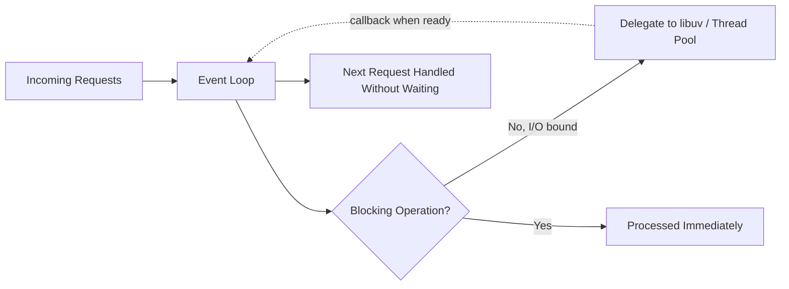
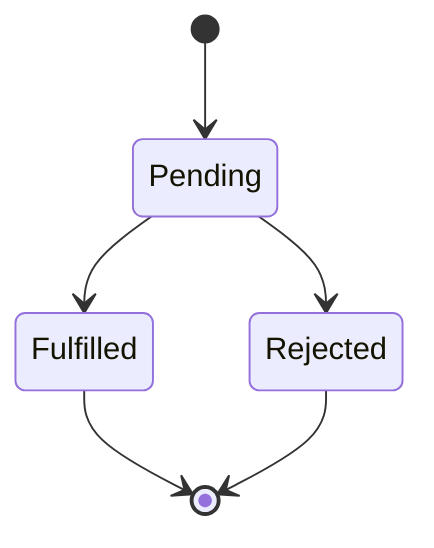
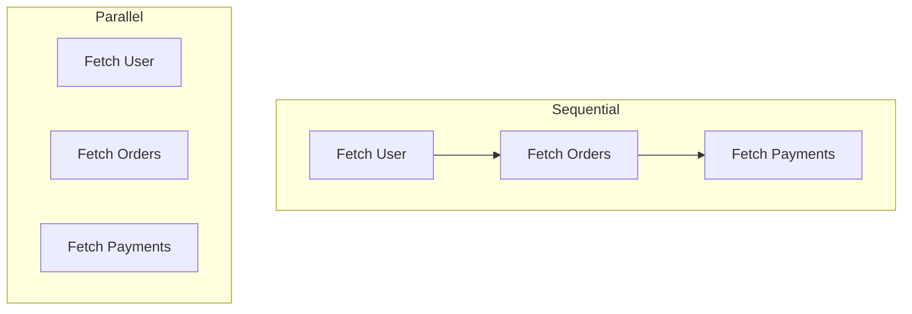

# ⚙️ Part 3 — Node.js Engineering

[← Previous: API Engineering](./02-api-engineering.md) · [Back to Table of Contents](../README.md#-table-of-contents) · [Next Chapter: Database Engineering →](./04-database-engineering.md)

---

## Introduction

This chapter clears up one of the most common misconceptions in backend engineering: how Node.js actually achieves its performance, and how to work correctly with asynchronous code.

---

## Concepts

### Understanding Node.js

A common misconception: *"Node.js is fast because it is multi-threaded."*

**Not true.** Node.js is primarily:

- Single-threaded
- Event-driven
- Non-blocking

### Why Node Performs Well

Node spends most of its time waiting — waiting for databases, APIs, file systems, and networks. Instead of blocking, Node continues processing other requests.



> [!TIP]
> **Golden Rule**
>
> Node is fast because it avoids waiting, not because it does more work.

---

### Promises

A Promise represents future completion.

Think of ordering food. You place an order. You don't have the food yet, but you have a promise that it will arrive.

**Promise states:**



---

### Async / Await

Async/Await is cleaner syntax over Promises.

#### Sequential Execution

```text
Fetch User
  ↓
Fetch Orders
  ↓
Fetch Payments
```

Each step waits for the previous one. Use this when order matters and dependencies exist between steps.

#### Parallel Execution

```text
Fetch User
Fetch Orders
Fetch Payments
```

All start together. Use `Promise.all()`.



> [!TIP]
> **Golden Rule**
>
> Sequential when dependent. Parallel when independent.

---

### Common Async Mistakes

#### Mistake #1 — Using `async` inside `forEach`

```js
users.forEach(async user => {
  // ...
});
```

**Problem:** `forEach` does not wait. Execution becomes unpredictable.

**Use instead:**

```js
for (const user of users) {
  await doSomething(user);
}
```

or `Promise.all()`.

> [!WARNING]
> **Golden Rule**
>
> Never use `async` with `forEach`. Experienced Node developers avoid it completely.

#### Mistake #2 — Massive `Promise.all`

```text
100,000 users
  ↓
Promise.all()
```

**Problems:**

- Memory spikes
- Database overload
- API throttling
- Rate limit failures

**Solution:** use batching instead of firing everything at once.

> [!WARNING]
> **Golden Rule**
>
> Just because you can run 100,000 promises simultaneously doesn't mean you should.

---

### `Promise.all` vs. `Promise.allSettled`

| | `Promise.all` | `Promise.allSettled` |
|---|---|---|
| Behavior | If one promise fails, everything fails | Waits for all promises regardless of outcome |
| Returns | The first rejection (short-circuits) | Every success and failure |
| Useful for | Operations where every step must succeed | Notifications, reports, background jobs |

> [!TIP]
> **Golden Rule**
>
> Use `Promise.all` when every operation must succeed. Use `allSettled` when partial success is acceptable.

---

## Golden Rules Recap

| Rule | Summary |
|---|---|
| Node avoids waiting, it doesn't do more work | Single-threaded, event-driven, non-blocking |
| Sequential when dependent, parallel when independent | Match execution style to the actual dependency graph |
| Never use `async` with `forEach` | Use `for...of` or `Promise.all` instead |
| Don't fire unlimited concurrent promises | Batch large operations |
| Choose `all` vs. `allSettled` deliberately | Match the failure semantics you actually need |

---

## Summary

Node.js's performance comes from avoiding blocking work, not from parallel threads. Understanding Promises, async/await, and their common pitfalls — accidental `forEach` misuse and unbounded `Promise.all` calls — is essential to writing backend code that stays fast and predictable as traffic grows.

---

[← Previous: API Engineering](./02-api-engineering.md) · [Back to Table of Contents](../README.md#-table-of-contents) · **Next Chapter →** [04 — Database Engineering](./04-database-engineering.md)
