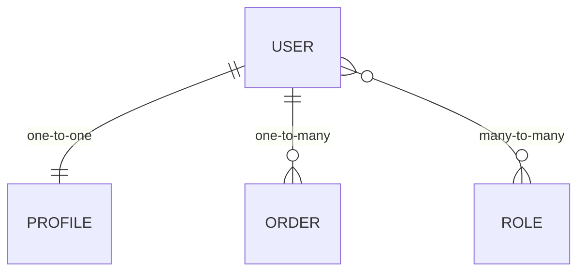
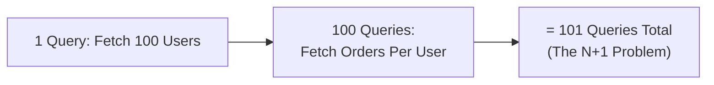
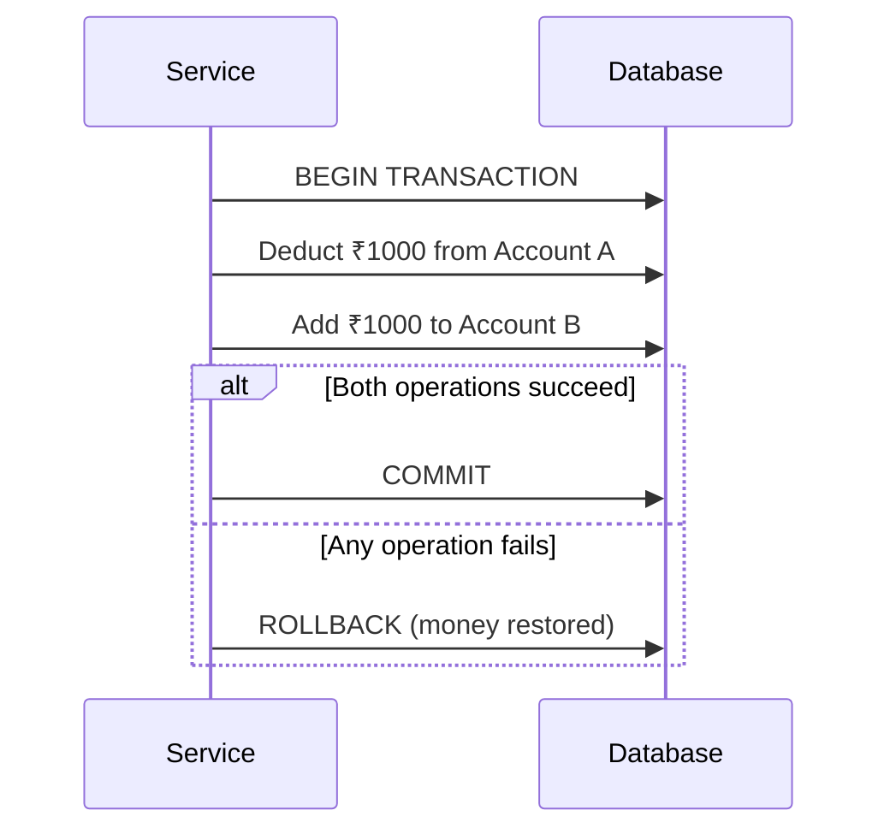

# 🗄️ Part 4 — Database Engineering

[← Previous: Node.js Engineering](./03-nodejs-engineering.md) · [Back to Table of Contents](../README.md#-table-of-contents) · [Next Chapter: Performance & Scalability →](./05-performance-and-scalability.md)

---

## Introduction

Many backend engineers spend most of their time writing application code. However, most production performance problems originate from the database layer.

A poorly designed query can make the fastest API slow. A missing index can make a simple request take seconds. A bad schema can create years of technical debt.

> [!IMPORTANT]
> **Golden Rule**
>
> Most performance problems are data problems before they are code problems.

---

## Concepts

### Understanding the Database Layer

Think of the database as the system of record. Your application may restart. Your servers may scale. Your cache may be cleared. **The database remains the source of truth.**

**Responsibilities of the database** — store users, orders, products, payments, and audit records reliably and consistently.

### Database Design

Good database design makes future changes easier. Bad database design creates permanent complexity.

**Goals of good design:**

- Consistency
- Maintainability
- Query performance
- Data integrity

#### Common Relationships



| Relationship | Example | Meaning |
|---|---|---|
| One-to-One | User ↔ Profile | One user has one profile |
| One-to-Many | User ↔ Orders | One user can have many orders |
| Many-to-Many | Users ↔ Roles | Users can have multiple roles; roles can belong to multiple users |

> [!TIP]
> **Golden Rule**
>
> Model relationships clearly. Confusing relationships create confusing applications.

---

### Query Optimization

Not all queries are equal.

**Bad:**

```sql
SELECT * FROM users;
```

**Better:**

```sql
SELECT id, email FROM users;
```

**Why?** Fetching unnecessary data uses memory, uses network bandwidth, and slows queries down.

> [!TIP]
> **Golden Rule**
>
> Fetch only what you need.

---

### Database Indexes

An index is similar to a book's table of contents. Imagine finding a word in a 1000-page book — without an index, you read page by page; with an index, you jump directly to the location. Databases work similarly.

**Example:** Searching users by email — `WHERE email = ?`

| | Without Index | With Index |
|---|---|---|
| Behavior | Full table scan | Direct lookup |

**Common index candidates:** `email`, `user_id`, `status`, `created_at`, foreign keys.

> [!WARNING]
> **Warning**
>
> Indexes improve reads but slightly slow writes. More indexes are not always better.

> [!TIP]
> **Golden Rule**
>
> Index fields that are searched often, not fields that simply exist.

---

### N+1 Query Problem

One of the most common backend mistakes.

**Example:** Fetch 100 users, then fetch orders for each user individually.



```
1 query
+ 100 queries
= 101 queries
```

**Better:** use joins or eager loading — 1 query instead of 101.

> [!TIP]
> **Golden Rule**
>
> If a query count grows with the amount of data, investigate it.

---

### Transactions

We discussed transactions in [Part 1](./01-backend-architecture.md#transactions). Now let's understand why they matter with a real example.

**Real Example — Bank Transfer**

Move ₹1000 from Account A to Account B.

**Process:** Deduct ₹1000 from A, add ₹1000 to B.

Imagine: deduction succeeds, addition fails — money disappears.



Transactions prevent this. Either both succeed, or both fail.

> [!IMPORTANT]
> **Golden Rule**
>
> If partial completion creates inconsistency, use a transaction.

---

## Golden Rules Recap

| Rule | Summary |
|---|---|
| Data problems come before code problems | Most performance issues start at the database layer |
| Model relationships clearly | Avoid confusing one-to-one/one-to-many/many-to-many design |
| Fetch only what you need | Avoid `SELECT *` |
| Index what's searched, not everything | Balance read speed against write cost |
| Watch for the N+1 problem | Use joins / eager loading instead of per-row queries |
| Use transactions for multi-step writes | Protect against partial completion |

---

## Summary

The database is the source of truth for your entire system, so treating it as an afterthought is one of the most expensive mistakes a backend engineer can make. Clear relationships, deliberate indexing, lean queries, N+1 awareness, and transactional integrity are what keep a system consistent and fast as data grows.

---

[← Previous: Node.js Engineering](./03-nodejs-engineering.md) · [Back to Table of Contents](../README.md#-table-of-contents) · **Next Chapter →** [05 — Performance & Scalability](./05-performance-and-scalability.md)
