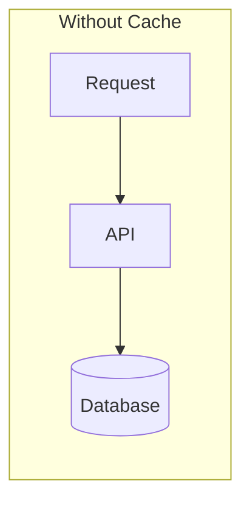
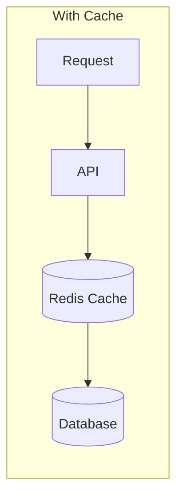
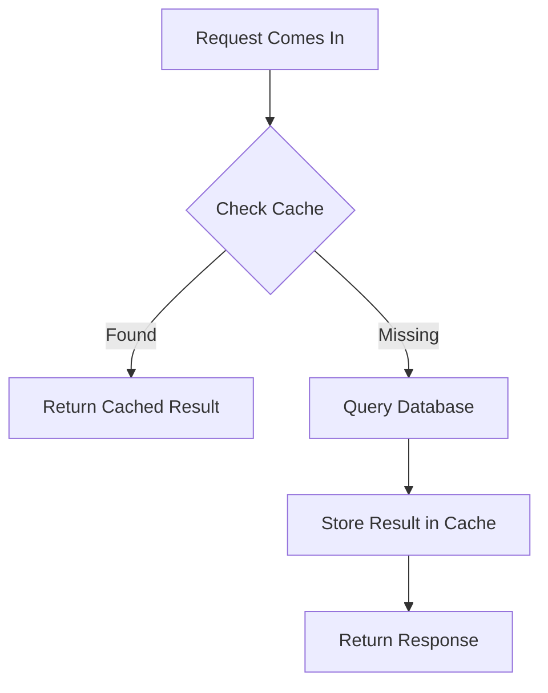
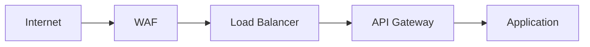
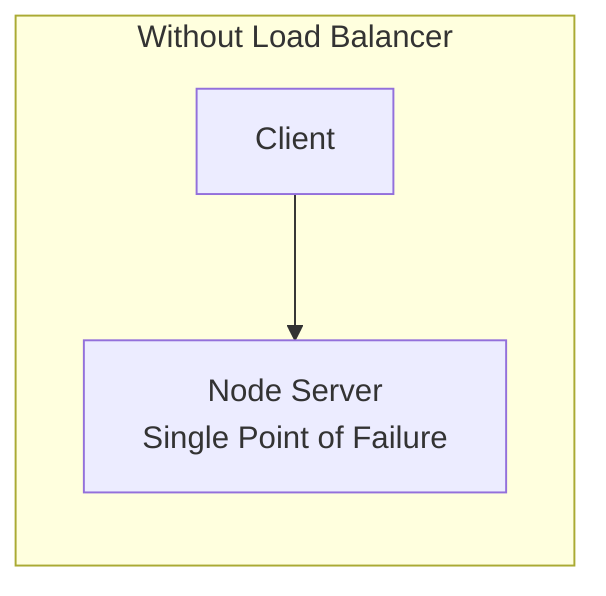
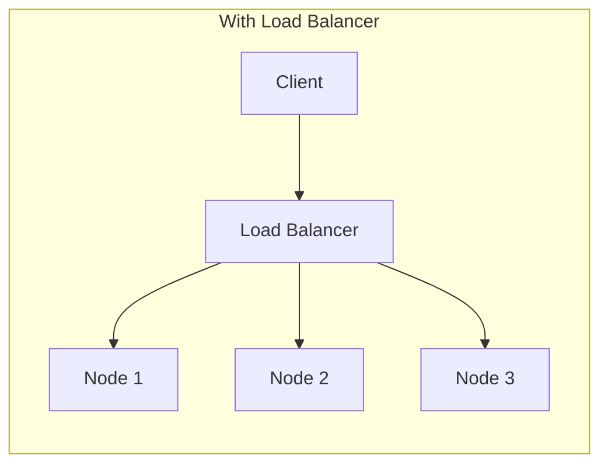
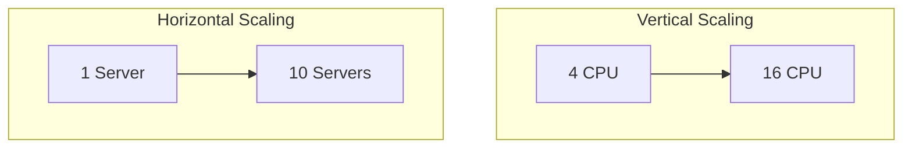

# 🚀 Part 5 — Performance & Scalability

[← Previous: Database Engineering](./04-database-engineering.md) · [Back to Table of Contents](../README.md#-table-of-contents) · [Next Chapter: Production Engineering →](./06-production-engineering.md)

---

## Introduction

Performance and scalability are related but distinct concerns, and confusing them leads to the wrong engineering priorities.

**Performance** means how fast a system responds — API latency, query speed, response time.

**Scalability** means how well a system handles growth:

```text
100 users
  ↓
10,000 users
  ↓
1,000,000 users
```

Can the system continue operating effectively?

| | Performance | Scalability |
|---|---|---|
| Focus | Fast **today** | Fast **tomorrow** |

> [!IMPORTANT]
> **Golden Rule**
>
> Performance solves today's problems. Scalability solves tomorrow's problems.

---

## Concepts

### Caching

Databases are expensive. Repeatedly asking the database the same question wastes resources. Caching solves this.

**What is caching?** Store frequently accessed data in faster storage — commonly Redis.





Without a cache, every request hits the database. With a cache, most requests never reach the database.

#### Cache-Aside Pattern

The most common caching strategy.



| Step | Action |
|---|---|
| 1 | Check cache |
| 2 | If found → return result |
| 3 | If missing → query database |
| 4 | Store result in cache |
| 5 | Return response |

**Good cache candidates:** product catalogs, country lists, feature flags, configuration data, lookup tables.

**Poor cache candidates:** payment balances, real-time financial data, highly volatile information.

#### Cache Invalidation

The hardest part of caching.

**Example:**

| Source | Price |
|---|---|
| Database | 100 |
| Cache | 90 |

The application now serves incorrect information. When data changes, invalidate the cache.

> [!TIP]
> **Golden Rule**
>
> Cache reads. Invalidate on writes.

---

### Rate Limiting

Every public API needs protection. Without limits, one user can consume all resources — 1,000,000 requests can lead to CPU exhaustion, memory pressure, and database overload.

**What rate limiting does.** It defines usage boundaries.

```text
Example: 100 requests/minute
Beyond that: 429 Too Many Requests
```

**Common strategies:**

| Strategy | Description |
|---|---|
| Fixed Window | Simple — count requests per time period |
| Sliding Window | More accurate — tracks activity continuously |
| Token Bucket | Most commonly used — allows bursts while enforcing limits |

**Where should rate limiting live?** As early as possible:



Earlier is always better — blocking requests before they reach application servers saves resources.

> [!TIP]
> **Golden Rule**
>
> The best request is the one you never have to process.

---

### Load Balancers

Eventually one server becomes insufficient. Load balancers solve this problem.





Traffic is distributed across multiple nodes.

**Benefits:**

| Benefit | Description |
|---|---|
| Scalability | Add more servers |
| Availability | One server fails; application remains available |
| Health Checks | Unhealthy servers removed automatically |
| SSL Termination | Load balancer handles HTTPS; application servers stay simpler |

> [!TIP]
> **Golden Rule**
>
> Always assume your application will eventually run on multiple servers.

---

### Horizontal Scaling

One server — say, 4 CPU / 16 GB RAM — eventually becomes insufficient. There are two choices.



| Strategy | Approach | Example |
|---|---|---|
| Vertical Scaling | Increase server size | 4 CPU → 16 CPU |
| Horizontal Scaling | Add more servers | 1 server → 10 servers |

Most large systems prefer horizontal scaling.

**Requirements for horizontal scaling.** Applications should be:

- Stateless
- Session-independent
- Cache-aware

> [!TIP]
> **Golden Rule**
>
> Design as if another server could be added tomorrow.

---

### Performance Optimization Mindset

Many engineers optimize too early.

**Bad approach:** optimize everything.

**Good approach:** measure first, optimize second.

**Ask:**

- Is the database slow?
- Is the network slow?
- Is the CPU overloaded?
- Is a cache missing?

> [!IMPORTANT]
> **Golden Rule**
>
> Never optimize what you haven't measured.

---

## Golden Rules Recap

| Rule | Summary |
|---|---|
| Performance is today, scalability is tomorrow | Don't conflate the two goals |
| Cache reads, invalidate on writes | The cache-aside pattern in one sentence |
| The best request is one you never process | Rate limit as early in the pipeline as possible |
| Assume multi-server from day one | Design stateless, session-independent services |
| Never optimize what you haven't measured | Profile before you tune |

---

## Summary

Performance keeps today's system fast; scalability keeps tomorrow's system alive. Caching, rate limiting, load balancing, and horizontal scaling are the standard toolkit for both — but none of them substitute for measuring first. Optimize the architecture around real bottlenecks, not assumed ones.

---

[← Previous: Database Engineering](./04-database-engineering.md) · [Back to Table of Contents](../README.md#-table-of-contents) · **Next Chapter →** [06 — Production Engineering](./06-production-engineering.md)
