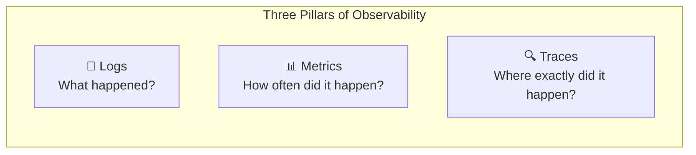
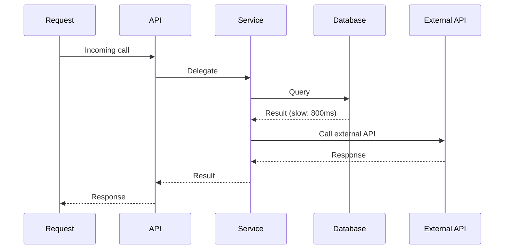
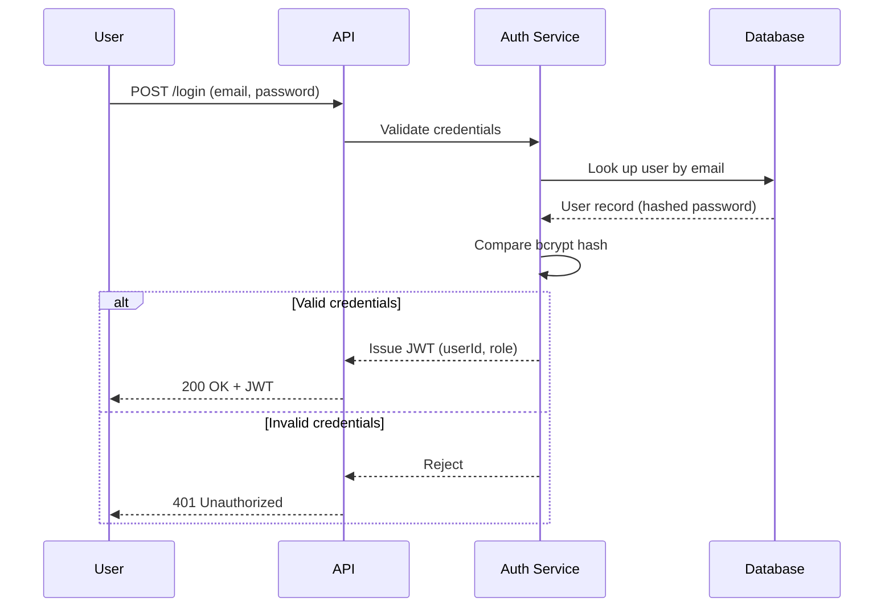
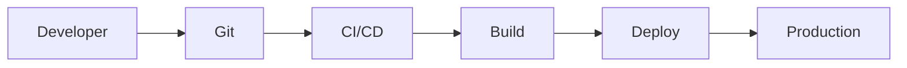
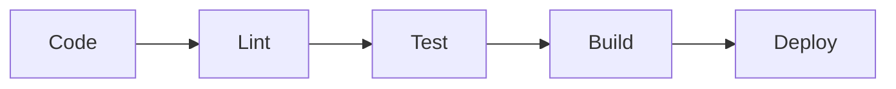

# 🏭 Part 6 — Production Engineering

[← Previous: Performance & Scalability](./05-performance-and-scalability.md) · [Back to Table of Contents](../README.md#-table-of-contents) · [Next Chapter: Senior Engineering Principles →](./07-senior-engineering-principles.md)

---

## Introduction

Many engineers spend most of their time writing features. Production engineering is about keeping those features running reliably.

**A feature that works on your machine but fails in production has little value.**

| | Development Mindset | Production Mindset |
|---|---|---|
| Focus | Functionality, feature delivery | Reliability, availability, observability, recovery |

> [!IMPORTANT]
> **Golden Rule**
>
> Building software is only half the job. Operating it is the other half.

---

## Concepts

### Logging

Sooner or later, something will fail. The question is: can you understand why? Logs answer that question.

**Why logging exists.** Imagine a customer reports "Payment failed." Questions immediately arise:

- Which user?
- Which order?
- Which payment provider?
- What error occurred?
- How often is this happening?

Without logs, you are guessing. With logs, you are investigating.

#### Good Logs vs. Bad Logs

**Bad:**

```text
Something failed
```

This tells you nothing.

**Good** — a log should provide context:

```json
{
  "requestId": "a83f-92cd",
  "userId": "user_1029",
  "endpoint": "POST /payments",
  "duration": "412ms",
  "status": "failed",
  "error": "Gateway timeout after 3 retries"
}
```

#### Log Levels

| Level | Meaning |
|---|---|
| `ERROR` | Application failure — something failed and requires investigation |
| `WARN` | Unexpected but recoverable situation; system continues functioning |
| `INFO` | Normal application activity |
| `DEBUG` | Detailed information used during troubleshooting |

#### What Should Never Be Logged

> [!CAUTION]
> Never log:
>
> - Passwords
> - OTPs
> - JWT tokens
> - API secrets
> - Credit card details
> - Sensitive personal data

> [!TIP]
> **Golden Rule**
>
> If production breaks at 2 AM, your logs should tell you why.

---

### Monitoring

Logs tell you *what* happened. Monitoring tells you *when* something is wrong.

**Why monitoring matters.** Imagine error rate = 35%. Customers know. Management knows. Social media knows. **Your monitoring system should know first.**

#### Key Metrics to Monitor

| Metric | What It Tells You |
|---|---|
| Response Time | How quickly requests complete |
| Error Rate | Percentage of failed requests |
| Throughput | Requests per second |
| CPU Usage | Server workload |
| Memory Usage | Application memory consumption |
| Database Performance | Slow queries, connection usage |

> [!TIP]
> **Golden Rule**
>
> If you're not measuring it, you're managing it blindly.

---

### Observability

Observability helps explain system behavior, and is traditionally described using three pillars.



**Tracing example:**



Tracing helps identify the slow component.

> [!IMPORTANT]
> **Golden Rule**
>
> Logs explain incidents. Metrics detect incidents. Traces diagnose incidents.

---

### Error Handling

Errors are normal. Expect them. Design for them.

**Common sources of failure:**

- Database unavailable
- Third-party API unavailable
- Timeout
- Invalid request
- Network issue

> [!WARNING]
> **Common Mistake**
>
> ```js
> try {
>   // ...
> } catch (error) {
>   // do nothing
> }
> ```
>
> The problem is hidden. The issue remains unresolved.

**Better approach:**

- Capture error
- Add context
- Log error
- Return proper response
- Propagate when necessary

#### Centralized Error Handling

Instead of Controller A, Controller B, and Controller C all handling errors differently, use a **Global Error Middleware**.

**Benefits:** consistency, maintainability, less duplication.

> [!TIP]
> **Golden Rule**
>
> Every error should either be handled or propagated. Never silently ignore it.

---

### Environment Variables

Applications require configuration — database URL, JWT secret, API keys, Redis host.

**Bad practice — hardcoding values:**

```text
password = admin123
```

**Better practice — use environment variables:**

```text
DB_HOST
DB_PASSWORD
JWT_SECRET
```

**Benefits:** security, flexibility, easier deployments.

> [!TIP]
> **Golden Rule**
>
> Code should be portable. Configuration should be external.

---

### Security Fundamentals

Security is not a feature. **Security is a requirement.**

#### Principle of Least Privilege

Every component should have only the permissions it needs.

**Example:**

| Application Needs | Application Does NOT Need |
|---|---|
| Read Orders | Drop Database |
| Create Orders | |

> [!TIP]
> **Golden Rule**
>
> Grant access based on necessity, not convenience.

#### Input Validation

Never trust user input. Every request should be considered hostile until validated.

**Examples of threats:** SQL Injection, NoSQL Injection, malformed payloads. Validation protects your application.

#### Password Storage

Never store passwords directly. **Never.**

Use `bcrypt` or `argon2`. Reason: if the database leaks, passwords remain protected.

> [!CAUTION]
> **Golden Rule**
>
> If passwords are readable, security has already failed.

#### HTTPS

HTTPS encrypts communication. Without HTTPS, anyone between client and server can inspect traffic. **Always use HTTPS in production.**

#### CORS

Cross-Origin Resource Sharing controls which domains can access your APIs.

| Bad ❌ | Better ✅ |
|---|---|
| Allow everyone | Allow only trusted origins |

> [!TIP]
> **Golden Rule**
>
> Access should be explicitly allowed, not implicitly trusted.

#### Secrets Management

Applications use secrets — database credentials, API tokens, encryption keys.

> [!CAUTION]
> **Never:**
>
> - Commit secrets to Git
> - Share secrets through chat
> - Store secrets in source code

> [!TIP]
> **Golden Rule**
>
> Treat secrets like passwords.

---

### Authentication Flow

Bringing several concepts from this and the previous chapter together, a typical authentication flow looks like this:



---

### Deployment Fundamentals

Deployment is the process of releasing software.

**Typical flow:**



**Goal:** reliable and repeatable releases.

> [!TIP]
> **Golden Rule**
>
> Deployments should be boring. Exciting deployments usually mean problems.

---

### CI/CD

**CI** — Continuous Integration. **CD** — Continuous Delivery / Deployment.

**Benefits:** automated testing, consistent builds, faster releases, reduced human error.

**Typical pipeline:**



> [!TIP]
> **Golden Rule**
>
> If a process is repeated frequently, automate it.

---

### Docker

Docker packages an application, its dependencies, and its runtime into a container.

**Why Docker exists.** Without Docker, "works on my machine" becomes common. Docker ensures consistency — development and production behave similarly.

> [!TIP]
> **Golden Rule**
>
> Containers reduce environment-related surprises.

---

### Kubernetes

As applications grow, managing containers manually becomes difficult.

Kubernetes helps manage:

- Scaling
- Recovery
- Deployment
- Networking
- Service Discovery

**Example:** a server crashes — Kubernetes automatically starts a replacement.

> [!TIP]
> **Golden Rule**
>
> Humans should not manually manage hundreds of containers.

---

### Incident Response

Production incidents happen — even at world-class companies.

| Good Teams Focus On | Bad Teams Focus On |
|---|---|
| Detection | Blame |
| Containment | |
| Recovery | |
| Prevention | |

> [!IMPORTANT]
> **Golden Rule**
>
> Fix systems, not people.

---

### Production Readiness Checklist

Before deployment, ask:

| Area | Question |
|---|---|
| Functionality | Does it work? |
| Validation | Is input validated? |
| Error Handling | Are errors handled correctly? |
| Logging | Can issues be debugged? |
| Security | Are secrets protected? |
| Performance | Any obvious bottlenecks? |
| Database | Are indexes required? |
| Monitoring | Can failures be detected? |
| Testing | Are critical flows covered? |
| Documentation | Can another engineer understand it? |

---

### Final Production Principle

Many engineers measure success by feature delivery. Production engineers measure success differently.

**Success is:** reliable, predictable, maintainable, observable, recoverable.

A system that survives growth, failures, traffic spikes, deployments, and human mistakes is a successful system.

> [!IMPORTANT]
> **Golden Rule**
>
> A backend engineer builds features. A senior backend engineer builds systems that continue working after the feature is deployed.

---

## Golden Rules Recap

| Rule | Summary |
|---|---|
| Building is half the job; operating is the other half | Production mindset ≠ development mindset |
| Logs should explain why something broke at 2 AM | Structured, contextual logging |
| Logs explain, metrics detect, traces diagnose | The three pillars of observability |
| Every error must be handled or propagated | No silent failures |
| Configuration lives outside the code | Environment variables, not hardcoded values |
| Security is a requirement, not a feature | Least privilege, validated input, hashed passwords, HTTPS, CORS, secrets management |
| Deployments should be boring | Automate with CI/CD, containers, and orchestration |
| Fix systems, not people | Blameless incident response |

---

## Summary

Production engineering is where reliability is won or lost. Structured logging, proactive monitoring, full observability, disciplined error handling, externalized configuration, layered security, and automated, boring deployments together form the operating discipline that keeps a system alive long after the last feature was shipped.

---

[← Previous: Performance & Scalability](./05-performance-and-scalability.md) · [Back to Table of Contents](../README.md#-table-of-contents) · **Next Chapter →** [07 — Senior Engineering Principles](./07-senior-engineering-principles.md)
