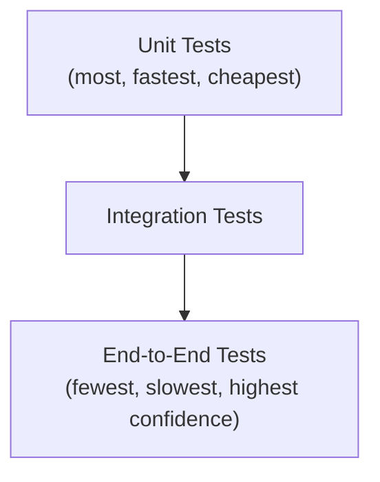
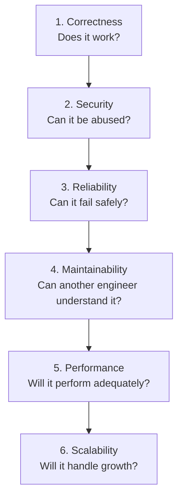

# 🎓 Part 7 — Engineering Practices & Senior Engineering Principles

[← Previous: Production Engineering](./06-production-engineering.md) · [Back to Table of Contents](../README.md#-table-of-contents)

---

## Introduction

Most engineers learn how to write code. Fewer engineers learn how to maintain code. Even fewer learn how to design systems that remain maintainable for years.

This chapter focuses on the habits and principles that separate junior, mid-level, and senior engineers.

---

## Concepts

### Writing Code for Humans

A common misconception: *code is written for computers.*

**Wrong.** Computers execute code. Humans maintain it. Most code is read far more often than it is written.

**Example:** Imagine revisiting code you wrote 18 months ago. If it takes 30 minutes to understand, that code has already failed one of its jobs.

> [!IMPORTANT]
> **Golden Rule**
>
> Code is a communication tool before it is an execution tool.

---

### Readability Over Cleverness

Many developers try to impress others with clever code. Experienced engineers optimize for clarity.

| Bad ❌ | Good ✅ |
|---|---|
| Complex one-liners | Simple variables |
| Nested ternaries | Clear naming |
| Multiple hidden side effects | Explicit logic |

> [!TIP]
> **Golden Rule**
>
> The best code is usually the code that requires the least explanation.

---

### Naming Things

One of the hardest problems in software engineering. Good naming dramatically improves maintainability.

| Bad Names ❌ | Good Names ✅ |
|---|---|
| `data` | `customerProfile` |
| `temp` | `paymentStatus` |
| `value` | `invoiceAmount` |
| `obj` | `userRepository` |
| `response2` | |

Names should reveal intent.

> [!TIP]
> **Golden Rule**
>
> If a variable requires a comment to explain its purpose, it probably needs a better name.

---

### Code Reviews

Code reviews are not merely for finding bugs. They improve quality, consistency, knowledge sharing, and architecture alignment.

**What to review:**

| Dimension | Question |
|---|---|
| Correctness | Does it work? |
| Security | Any vulnerabilities? |
| Performance | Any obvious bottlenecks? |
| Maintainability | Can another engineer understand it? |
| Testing | Are important paths covered? |
| Architecture | Is logic placed in the correct layer? |

> [!TIP]
> **Golden Rule**
>
> Review the design, not just the syntax.

---

### Testing Strategy

Many teams misunderstand testing. The goal is **not** to increase coverage numbers — the goal is to increase confidence.

#### Testing Pyramid

| Layer | Tests | Examples | Advantages | Disadvantages |
|---|---|---|---|---|
| Unit Tests | Individual functions | Price calculation, validation rules, business logic | Fast, reliable, easy to run | Limited scope |
| Integration Tests | Interaction between components | Service + Database, Service + Redis, Service + External API | More realistic, catches integration issues | Slower than unit tests |
| End-to-End Tests | Complete user workflows | Register user → create order → process payment → generate invoice | Highest confidence | Slowest tests |

> [!TIP]
> **Golden Rule**
>
> Test critical business workflows, not implementation details.

---

### Technical Debt

Every shortcut creates debt. Sometimes debt is acceptable. Ignoring debt is not.

**Example:** you skip validation to meet a deadline. That shortcut becomes future work.

**Debt becomes dangerous when:**

- Nobody tracks it
- Nobody prioritizes it
- Nobody understands it

> [!WARNING]
> **Golden Rule**
>
> Technical debt is like financial debt. Small amounts are manageable. Uncontrolled debt becomes crippling.

---

### Refactoring

Refactoring means improving code without changing behavior.

**Reasons to refactor:** improve readability, reduce duplication, improve maintainability, simplify architecture.

| Bad Reason ❌ | Good Reason ✅ |
|---|---|
| Refactor because you are bored | Refactor because future changes are becoming difficult |

> [!TIP]
> **Golden Rule**
>
> Refactoring should improve clarity, not satisfy personal preferences.

---

### DRY Principle

**DRY** — Don't Repeat Yourself.

**Bad:** the same business rule copied into Controller A, Controller B, and Controller C. Future changes require updating multiple locations.

**Good:** a single source of truth.

> [!WARNING]
> **Warning**
>
> Many developers over-apply DRY. Not all duplication is harmful.

> [!TIP]
> **Golden Rule**
>
> Duplicate knowledge is dangerous. Duplicate code is sometimes acceptable.

---

### KISS Principle

**KISS** — Keep It Simple, Stupid.

Engineers often create solutions for problems that do not exist.

**Bad:** 5 abstractions, 8 interfaces, and 3 design patterns for a simple CRUD endpoint.

**Good:** simple code, simple architecture, simple maintenance.

> [!TIP]
> **Golden Rule**
>
> Simple systems are easier to understand, test, debug, and scale.

---

### YAGNI Principle

**YAGNI** — You Aren't Gonna Need It.

**Example:** building microservices, an event bus, Kafka, and CQRS for a system with 10 users.

Build for current requirements. Design for future growth. **Do not build future growth today.**

> [!TIP]
> **Golden Rule**
>
> Future-proofing often becomes future complexity.

---

### Maintainability

Many engineers focus on performance. Few focus on maintainability.

**Reality:** most systems spend years being maintained. They spend weeks being developed.

**Ask:**

- Can another engineer understand this?
- Can another engineer modify this safely?
- Can another engineer debug this quickly?

> [!IMPORTANT]
> **Golden Rule**
>
> Maintainability is a feature.

---

### Common Backend Anti-Patterns

| Anti-Pattern | Problem | Solution |
|---|---|---|
| **Fat Controllers** — controller contains validation, business logic, database queries, and email logic | Impossible to scale, difficult to test | Move logic into services |
| **Business Logic in Repositories** — repositories deciding business behavior | Responsibilities become mixed | Keep business logic in services |
| **Missing Transactions** — multiple writes with no rollback strategy | Data inconsistency | Protect workflows with transactions |
| **Missing Validation** — trusting user input | Security and data integrity issues | Validate everything |
| **No Logging** — a problem occurs and no evidence exists | Impossible to debug | Add structured logs |
| **Massive `Promise.all`** — launching thousands of operations simultaneously | Memory spikes, database overload | Use batching |

---

### Senior Engineer Thinking

| Junior Engineers Ask/Think | Senior Engineers Ask/Think |
|---|---|
| "How do I build this?" | "What happens when this fails?" |
| Feature | System |
| Optimize: Code | Optimize: Architecture |
| "Can this work?" | "Can this survive growth?" |

---

### Decision Framework

Before implementing anything, ask, **in this order:**

| Order | Dimension | Question |
|---|---|---|
| 1 | Correctness | Does it work? |
| 2 | Security | Can it be abused? |
| 3 | Reliability | Can it fail safely? |
| 4 | Maintainability | Can another engineer understand it? |
| 5 | Performance | Will it perform adequately? |
| 6 | Scalability | Will it handle growth? |

> [!IMPORTANT]
> **Golden Rule**
>
> Most production incidents happen because the first four were ignored.

---

### The Layering Principle

If you remember only one architecture principle from this handbook, remember this:

| Layer | Knows |
|---|---|
| Controllers | HTTP |
| Services | Business |
| Repositories | Data |
| Database | Truth |

When responsibilities remain separated: testing becomes easier, refactoring becomes safer, scaling becomes simpler, and debugging becomes faster.

> [!IMPORTANT]
> **Golden Rule**
>
> Keep Controllers Thin, Services Smart, and Repositories Dumb.
>
> This principle alone can keep a codebase healthy even after it grows from a handful of APIs to hundreds of services and millions of users.

---

## Final Thoughts

Frameworks change. Libraries change. Databases evolve. Cloud providers evolve. **The engineering principles in this handbook remain largely the same.**

The best backend engineers are not the ones who memorize the most tools. They are the ones who consistently make good engineering decisions.

---

## The Senior Backend Engineer's Checklist

Before shipping any feature, ask:

- [ ] Is validation implemented?
- [ ] Are business rules in services?
- [ ] Are repositories focused on data access?
- [ ] Are transactions protecting critical workflows?
- [ ] Is error handling consistent?
- [ ] Are logs sufficient for debugging?
- [ ] Is monitoring available?
- [ ] Is security considered?
- [ ] Are indexes required?
- [ ] Is caching appropriate?
- [ ] Are tests covering critical paths?
- [ ] Can another engineer understand this code six months from now?

---

## The Final Principle

> A junior engineer writes code that works.
>
> A mid-level engineer writes code that others can maintain.
>
> A senior engineer designs systems that continue to work, continue to scale, and continue to be maintainable long after the original author has left the project.
>
> **Build systems, not just features.**

---

## Summary

Senior engineering is a mindset shift: from writing code that works to designing systems that keep working. Readable naming, meaningful code reviews, a deliberate testing strategy, managed technical debt, and the discipline of DRY, KISS, and YAGNI all compound into one outcome — maintainability. And maintainability, more than any framework or algorithm, is what separates systems that last from systems that get rewritten.

---

[← Previous: Production Engineering](./06-production-engineering.md) · [Back to Table of Contents](../README.md#-table-of-contents) · [🏠 Back to README](../README.md)
